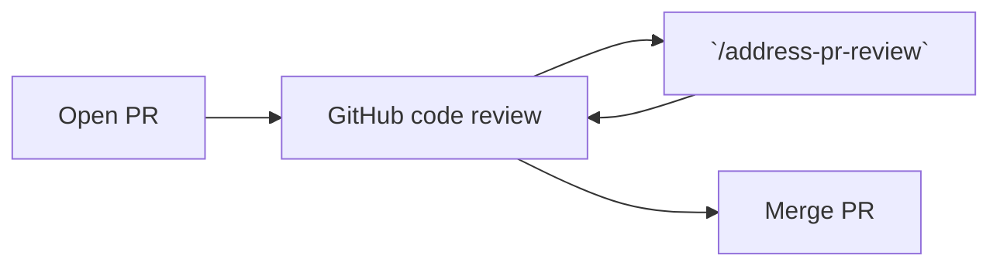
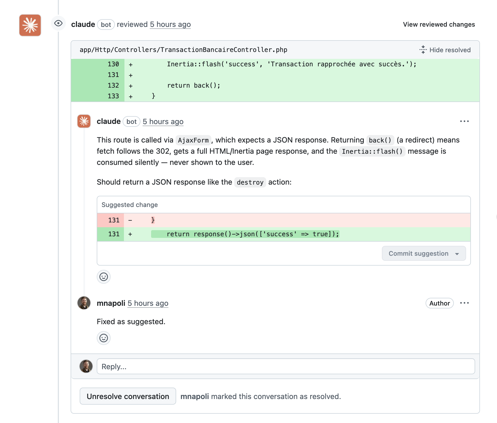

# Address PR Review

An agent skill that **reads pull request comments and CI failures and fixes them automatically**.

Works in Claude Code, Codex, Cursor...



Open a PR and invoke `/address-pr-review` in Claude Code (or `$address-pr-review` in Codex):

- Fixes CI failures
- Reads inline pull request comments (ignores resolved comments)
- Makes code changes
- Pushes and replies to each thread



## Prerequisites

- [GitHub CLI](https://cli.github.com/) (`gh`) installed and authenticated
- Claude Code, Codex, Cursor, or [any agent system that can run shell commands and make code changes](https://agentskills.io/home#where-can-i-use-agent-skills)

## Installation

### In Claude Code

Clone into your Claude Code skills directory:

```bash
git clone git@github.com:mnapoli/skill-address-pr-review.git ~/.claude/skills/address-pr-review
```

### In other systems

Most other agent systems read from a ".agents/skills" directory:

```bash
git clone git@github.com:mnapoli/skill-address-pr-review.git ~/.agents/skills/address-pr-review
```

## Usage

From a branch with an open PR:

```
/address-pr-review
```

Your agent will fetch unresolved threads and CI failures, fix the issues, and reply to reviewers.

## Tips

1. Run Claude Code's [code review in GitHub Actions](https://code.claude.com/docs/en/github-actions) for automatic reviews on every push
2. Run [Codex code review](https://developers.openai.com/codex/integrations/github/) as well
3. Review Claude and Codex's comments and "mark as resolved" those that don't make sense
4. Review the code yourself: open comments inline the PR diff
5. Launch `/address-pr-review` locally so that all comments are addressed
6. Repeat until the PR is ready to merge

## Limitations

- CI failure extraction is designed for GitHub Actions — other CI systems may not work
